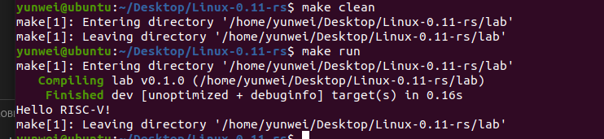

# Lab 1: RISC-V 实验报告 rust版

本部分的某些文件结构和代码可能和实验指导要求的有所不同。

## 文件结构和 Makefile

实验目录大概是这样（删掉了 target 编译文件夹）：

```
.
├── docs
│   └── setup.md
├── lab
│   ├── boot
│   │   └── riscv64
│   │       └── Image
│   ├── Cargo.lock
│   ├── Cargo.toml
│   ├── Makefile
│   ├── src
│   │   ├── arch
│   │   │   └── riscv
│   │   │       └── kernel
│   │   │           ├── head.S
│   │   │           └── vmlinux.lds
│   │   ├── init
│   │   │   └── mod.rs
│   │   └── main.rs
│   └── vmlinux
├── LICENSE
├── Makefile
├── README.md
└── rust-toolchain
```

根目录的 Makefile，这里只实现了三个简单的命令：

```Makefile
run:
	@make -C lab run

clean:
	@make -C lab clean

fmt:
	@cd lab && cargo fmt
```

主要的文件放在 lab 文件夹中，采用 `cargo new lab` 生成：

该目录下的 Makefile 如下，由于采用 cargo 进行编译和包管理，可以节省掉各级子目录的 Makefile 文件：

- 这部分的 qemu 配置命令有一点修改，使用 device 加载 Image 文件：

```Makefile
ARCH  		:= riscv64
TARGET      := $(ARCH)imac-unknown-none-elf
MODE        := debug
KERNEL_FILE := target/$(TARGET)/$(MODE)/lab
BOOT  		:= boot/$(ARCH)
BIN_FILE    := $(BOOT)/Image

QEMU_BINARY := qemu-system-riscv64
QEMUOPTS	:= -nographic -machine virt -bios none -device loader,file=$(BIN_FILE),addr=0x80000000

kernel:
	@cargo build

build: kernel boot
	@rust-objcopy --binary-architecture=riscv64 $(KERNEL_FILE) --strip-all -O binary $(BIN_FILE)
	@cp $(KERNEL_FILE) vmlinux

boot:
	@mkdir boot
	@mkdir $(BOOT)

qemu: build
	@$(QEMU_BINARY) $(QEMUOPTS)

debug: build
	@$(QEMU_BINARY) $(QEMUOPTS) -S -s

run: build qemu

clean:
	@cargo clean
	@rm -rf boot
	@rm vmlinux
```

## head.S 文件

```s
    .section .text.entry
    .globl _start
_start:
    csrw mstatus, x0;
    la t0, trap_machine;
    csrw mtvec, t0;
    li t0, 0x800
    csrw mstatus, t0;
    la t0, next_mret;
    csrw mepc, t0
    mret;

next_mret:
    la t0, trap_super;
    csrw stvec, t0;
    la sp, stack_top
    jal start_kernel

trap_machine:
trap_super:
    ret
```

## 其他

链接文件基本没有修改：

```ld
ENTRY(_start)
BASE_ADDRESS = 0x80000000;
SECTIONS
{   
    . = BASE_ADDRESS;
    .text : {
        *(.text.entry)
        *(.text .text.*)
    }
    .rodata : {
        *(.rodata .rodata.*)
    }
    .data : {
        *(.data .data.*)
    }
    .bss : {
        *(.sbss .bss .bss.*)
    }
    . += 0x8000;
    stack_top = .;
}
```

将 main.c 和 test.c 的功能合并，并对 panic 进行了简单错误处理，这一部分放在 init/mod.rs 中，使用串口输出信息并关机：

```rs
use core::panic::PanicInfo;

global_asm!(include_str!("../arch/riscv/kernel/head.S"));

#[no_mangle]
pub extern "C" fn start_kernel() -> ! {
    put_chars("Hello RISC-V!\n");
    shut_down();
    loop {}
}

#[panic_handler]
fn panic(info: &PanicInfo) -> ! {
    put_chars(info.message().unwrap().as_str().unwrap());
    shut_down();
    loop {}
}

fn shut_down() {
    const SIFIVE_TEST: u32 = 0x100000;
    const VIRT_TEST_FINISHER_PASS: u32 = 0x5555;
    unsafe {
        llvm_asm!("sh $0, 0($1)"::"r"(VIRT_TEST_FINISHER_PASS),"r"(SIFIVE_TEST));
    }
}

fn put_chars(msg: &str) {
    const UART16550A_DR: *mut u8 = 0x10000000 as *mut u8;
    for s in msg.as_bytes() {
        unsafe {
            *UART16550A_DR = s.clone();
        }
    }
}
```

## 实验结果

