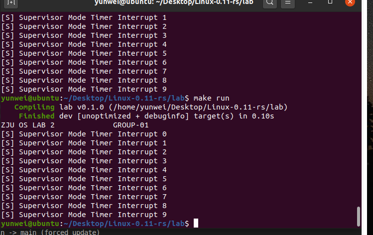

# Lab 2 RISC-V64 时钟中断处理

## 文件结构

lab 文件夹目录结构：

```
.
├── Cargo.lock
├── Cargo.toml
├── Makefile
└── src
    ├── arch
    │   └── riscv
    │       └── kernel
    │           ├── entry.S
    │           ├── head.S
    │           └── vmlinux.lds
    ├── init
    │   ├── interrupt.rs
    │   └── mod.rs
    ├── lib
    │   ├── console.rs
    │   ├── mod.rs
    │   └── register.rs
    └── main.rs
```

其中新添加了 `interrupt.rs` 负责具体处理终端相关的 rust 代码，`console.rs` 负责格式化输出相关操作，`register.rs` 里面是一些 rust inline 函数，负责部分 csr 寄存器相关读写操作；

我觉得纯粹用汇编来写比较麻烦所以就把部分操作换成内嵌汇编的函数啦。

## boot 和模式切换的修改，以及中断初始化设置：

目前稍微精简了一下汇编文件的结构，现在 `head.S` 只完成设置栈和跳转的功能：

head.S
```s
    .section .text.init
    .globl _start
_start:
    la sp, stack_top
    jal mmod_init
```

链接文件同样需要有些修改，包含入口点设置和 bss 段标签：

```ld
ENTRY(_start)
BASE_ADDRESS = 0x80000000;
SECTIONS
{   
    . = BASE_ADDRESS;
    .text : {
        *(.text.init)
        *(.text.entry)
        *(.text .text.*)
    }
    .rodata : {
        *(.rodata .rodata.*)
    }
    .data : {
        *(.data .data.*)
    }
    bss_start = .;
    .bss : {
        *(.sbss .bss .bss.*)
    }
    bss_end = .;
    . += 0x8000;
    stack_top = .;
}

```

部分初始化过程移动到了 lab/src/init/mod.rs 里面：

mmod_init 负责 m 态初始化，设置相关寄存器，设置中断，初始化时钟中断相关，初始化 bss 段：

src/init/mod.rs
```rs
#[no_mangle]
pub extern "C" fn mmod_init() {
    let mut x = r_mstatus();
    x = x & (!MSTATUS_MPP_MASK);
    x |= MSTATUS_MPP_S;
    w_mstatus(x);

    w_mepc(start_kernel as u64);

    w_satp(0);

    w_medeleg(0x0020);
    w_mideleg(0x0020);
    w_sie(r_sie() | SIE_SEIE | SIE_SSIE);

    w_mie(r_mie() | MIE_MTIE);

    timer_init();

    unsafe {
        for bit in bss_start..bss_end {
            *(bit as * mut u8) = 0;
        }
        llvm_asm!("mret");
    }
}
```

`timer_init()` 负责时钟中断初始化，并调用 `set_next_timeout()` 完成 MTIMECMP 自增：

src/init/interrupt.rs
```rs
pub fn timer_init() {
    set_next_timeout();
    w_mtvec(trap_m as u64);
    w_mstatus(r_mstatus() | MSTATUS_MIE);
}

fn set_next_timeout() {
    const CLINT_MTIME: u64 = 0x200bff8;
    const CLINT_MTIMECMP: u64 = 0x2004000;
    const INTERVAL: u64 = 10000000;
    unsafe {
        *(CLINT_MTIMECMP as *mut u64) = *(CLINT_MTIME as *const u64) + INTERVAL;
    }
}

```

然后进入 S 态，跳转进入 start_kernel() 函数, 其中进行了 s 态中断的初始化设置：

src/init/mod.rs
```rs
#[no_mangle]
pub extern "C" fn start_kernel() {
    interrupt::trap_init();
    println!("ZJU OS LAB 2             GROUP-01");
    loop {}
}
```

## 时钟中断处理

entry.S 负责寄存器保存，包含通用寄存器、eip 和 status 寄存器；具体操作在 rust 代码中利用内联汇编完成（略去部分通用寄存器保存和恢复操作）：

entry.S
```rs
.section .text.entry
.globl kerneltrap
.globl trap_s
.align 4
trap_s:
        addi sp, sp, -272

        # save the registers.
        sd ra, 0(sp)
        .......
        sd t6, 240(sp)

        csrr t0, sstatus
        csrr t1, sepc
        sd t0,  248(sp)
        sd t1,  256(sp)

        mv      a0, sp
        addi    a0, a0, 248

        call supervisor_trap_handler

        ld t0,  248(sp)
        ld t1,  256(sp)
        csrw sstatus, t0
        csrw sepc, t1
        
        # restore registers.
        ld ra, 0(sp)
        .......
        ld t6, 240(sp)

        addi sp, sp, 272

        sret

.globl trap_m
.align 4
trap_m:
        addi sp, sp, -272

        # save the registers.
        sd ra, 0(sp)
        .......
        sd t6, 240(sp)

        csrr t0, mstatus
        csrr t1, mepc
        sd t0,  248(sp)
        sd t1,  256(sp)

        mv      a0, sp
        addi    a0, a0, 248

        call machine_trap_handler

        ld t0,  248(sp)
        ld t1,  256(sp)
        csrw mstatus, t0
        csrw mepc, t1

        # restore registers.
        ld ra, 0(sp)
        .......
        ld t6, 240(sp)

        addi sp, sp, 272

        mret
```

m 态中断处理函数：

```rs
#[no_mangle]
pub extern "C" fn machine_trap_handler(context: &mut Context) {
    let mcause = r_mcause();
    const M_TIMER_INTERRUPT: u64 = (1 << 63) | 7;
    const S_ECALL: u64 = 9;
    if mcause == M_TIMER_INTERRUPT {
        w_mip(r_mip() | MIP_STIP);
        w_sie(r_sie() | SIE_STIE);
        w_mie(r_mie() & !MIE_MTIE);
    } else if mcause == S_ECALL {
        set_next_timeout();
        w_mie(r_mie() | MIE_MTIE);
        context.epc += 4;
    }
}
```

其中 context 是保存的 csr 寄存器（目前暂时省略了通用寄存器，m/s 态通用），主要是用于修改 epc：

```rs
#[repr(C)]
#[derive(Clone, Copy)]
pub struct Context {
    pub status: u64,
    pub epc: u64,
}
```
s 态中断处理函数：

```rs
#[no_mangle]
pub extern "C" fn supervisor_trap_handler(_context: &mut Context) {
    let scause = r_scause();
    const S_TIMER_INTERRUPT: u64 = (1 << 63) | 5;
    if scause == S_TIMER_INTERRUPT {
        unsafe {
            println!("[S] Supervisor Mode Timer Interrupt {}", TICKS);
            TICKS += 1;
            if TICKS >= 10 {
                shut_down();
            }
            w_sie(r_sie() & !SIE_STIE);
            llvm_asm!("ecall");
        }
    }
}
```

为了方便，暂时设置了 tick 十次关机。

## 结果



## 思考题

思考题：当处理同步异常时应该在退出前给
mepc+4，当处理中断时则不需要，请解释为什么要这样做：

- +4 才能跳转到下一条指令，如果没有 +4 的话就会永远在产生 trap 的那条指令上面陷入死循环，比如 `ecall`；中断的话由于是外部产生，所以不需要改变 pc，就能让原先的代码继续执行下去。

思考题：观察vmlinux和image，解释为什么要初始化bss段。

- 直接加载进来没有初始化的，而放在 bss 里面的全局变量默认是 0，所以需要初始化。

## 一点小疑惑

我这里的实现需要在进入 m 态中断处理程序的时候打开STIE 中断：`w_sie(r_sie() | SIE_STIE)`，然后在 S 态处理程序结束的时候关闭中断 `w_sie(r_sie() & !SIE_STIE)`，不然就会循环进入 S 态的时钟中断...类似这样：

```
mcause: 9223372036854775815
scause: 9223372036854775813
[S] Supervisor Mode Timer Interrupt 0
mcause: 9
scause: 9223372036854775813
[S] Supervisor Mode Timer Interrupt 1
mcause: 9
scause: 9223372036854775813
[S] Supervisor Mode Timer Interrupt 2
mcause: 9
scause: 9223372036854775813
[S] Supervisor Mode Timer Interrupt 3
mcause: 9
scause: 9223372036854775813
[S] Supervisor Mode Timer Interrupt 4
```

这个部分好像实验指导里面并没有提及....