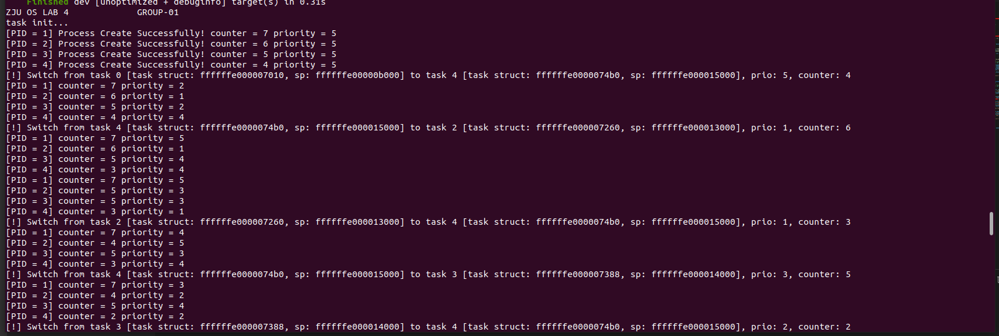

# Lab 4 RISC-V 虚拟内存管理

结合课堂学习的页式内存管理以及虚拟内存的相关知识，尝试在已有的程序上开启 MMU 并实现页映射，保证之前的进程调度能在虚拟内存下正常运行

## 文件结构

lab 文件夹目录结构：

```
.
├── Cargo.lock
├── Cargo.toml
├── Makefile
└── src
    ├── arch
    │   └── riscv
    │       └── kernel
    │           ├── entry.S
    │           ├── head.S
    │           └── vmlinux.lds
    ├── init
    │   ├── interrupt.rs
    │   ├── mod.rs
    │   ├── page.rs
    │   └── sched.rs
    ├── lib
    │   ├── console.rs
    │   ├── mod.rs
    │   └── register.rs
    └── main.rs

```

本次增加的代码主要在 `page.rs` 里面，主要处理分页相关的东西。

## vmlinux.lds

助教提供的版本并不能被 rust-lld 正确解析，因此我做了一点修改：

```
diff --git a/lab/src/arch/riscv/kernel/vmlinux.lds b/lab/src/arch/riscv/kernel/vmlinux.lds
index 8cecb85..1a8e79e 100644
--- a/lab/src/arch/riscv/kernel/vmlinux.lds
+++ b/lab/src/arch/riscv/kernel/vmlinux.lds
@@ -1,7 +1,7 @@
 OUTPUT_ARCH( "riscv" )
 ENTRY( _start )
 MEMORY {
-  ram (wxa!ri) : ORIGIN = 0x0000000080000000, LENGTH = 16M
-  ramv (wxa!ri) : ORIGIN = 0xffffffe000000000, LENGTH = 4096M
+  ram : ORIGIN = 0x0000000080000000, LENGTH = 128M
+  ramv : ORIGIN = 0xffffffe000000000, LENGTH = 4096M
 }
 PHDRS {
   text PT_LOAD;
@@ -43,6 +43,9 @@ SECTIONS {
   *(.bss .bss.*)
   PROVIDE(bss_end = .);
  } >ramv AT>ram :bss
+  .eh_frame  : ALIGN(0x1000) {
+   KEEP (*(.eh_frame))
+ } > ramv
  . = ALIGN(0x1000);
  . += 0x1000;
  init_stack_top = .;
```

内存区域属性保留的话，会报错如下：

```
note: rust-lld: error: src/arch/riscv/kernel/vmlinux.lds:4: invalid memory region attribute
          >>>   ram (wxa!ri) : ORIGIN = 0x0000000080000000, LENGTH = 16M
          >>>        ^
```

去掉内存区域属性之后，会产生如下错误，于是又加了个 .eh_frame 的 section:

```
note: rust-lld: error: no memory region specified for section '.eh_frame'
```

具体的情况我也不是非常清楚，我也不知道为啥 rust-lld 不支持这些属性...不过这样可以 work

## 修改系统启动部分代码

head.S 里面新增了一下保存 sp 的内容：

head.S
```s
    .section .text.init
    .globl _start
_start:
    la sp, stack_top
    csrrw sp, mscratch, sp
    la sp, stack_top
    jal mmod_init
```

主要的 m mode 初始化代码在 src/init/mod.rs 里面，mmod_init() 函数中，这部分几乎没有变化，只是增加或修改了这三个代码：

- 先设置satp寄存器为0，暂时关闭MMU
- 通过修改medeleg寄存器，将instruction/load/store page fault托管到S模式下

```rs
     ...
    w_satp(0);

    w_medeleg(0xf0ff);
    w_mideleg(0xf0ff);
     ...
```

在 start_kernel 里面增加了一个 paging_init 函数调用，完成对虚拟内存部分的初始化：

```rs
#[no_mangle]
pub extern "C" fn start_kernel() {
    paging_init();
    println!("ZJU OS LAB 4             GROUP-01");
    trap_init();
    SchedTest::task_init();
    loop {}
}
```

`paging_init()` 函数调用 `create_mapping` 函数将内核起始（0x80000000）的16MB空间映射到高地址（以0xffffffe000000000为起始地址），同时也进行等值映射。将必要的硬件地址（如UART）进行等值映射，无偏移

这段代码按顺序实现了如下功能：

1. 开头的那一段是将 lds 里面的变量的地址提取出来，然后进行映射：
2. 映射分为 5 部分，按顺序：
     - 内核的 16 mb 等值映射
     - text 虚拟内存的映射
     - rodata 虚拟内存的映射
     - 内核其他部分的虚拟内存的映射
     - UART 的等值映射；
3. 开启分页，刷新tlb
4. 接下来一段是跳转到高地址的内存空间：
     - 将 paging_init 的返回地址 ra 加上 0xffffffdf80000000，使其跳转到 start_kernel 函数中 paging_init 的下一条指令；
     - 修改 sp
     - ret 跳转到高地址

```rs
pub fn paging_init() {
    unsafe {
        INIT_STACK_TOP_ADDR = &init_stack_top as *const usize as usize;
        KERNEL_END = &_end as *const usize as usize;
        let text_startp = &text_start as *const usize as usize;
        let text_endp = &text_end as *const usize as usize;
        let rodata_startp = &rodata_start as *const usize as usize;
        let rodata_endp = &rodata_end as *const usize as usize;
        let data_startp = &data_start as *const usize as usize;
        let kernel_pg = ppage_alloc();
        KERNEL_PTE = kernel_pg;
        create_mapping(
            kernel_pg,
            KERNEL_STARTPA,
            KERNEL_STARTPA,
            1024 * 16 * PGSIZE,
            PTE_R | PTE_W | PTE_X,
        );
        create_mapping(
            kernel_pg,
            text_startp + KERNEL_PVDIFF,
            text_startp,
            PGROUNDUP!(text_endp - text_startp),
            PTE_R | PTE_X,
        );
        create_mapping(
            kernel_pg,
            rodata_startp + KERNEL_PVDIFF,
            rodata_startp,
            PGROUNDUP!(rodata_endp - rodata_startp),
            PTE_R,
        );
        create_mapping(
            kernel_pg,
            data_startp + KERNEL_PVDIFF,
            data_startp,
            1024 * 16 * PGSIZE + KERNEL_STARTPA - data_startp,
            PTE_R | PTE_W,
        );
        create_mapping(kernel_pg, UART0, UART0, PGSIZE, PTE_R | PTE_W);
        w_satp((SATP_SV39 | ((kernel_pg) >> 12)) as u64);
        sfence_vma();
        asm!("ld ra, 168(sp)");
        asm!("add sp, sp, a0");
        asm!("li a0, 0xffffffdf80000000");
        asm!("la sp, init_stack_top");
        asm!("add sp, sp, a0");
        asm!("add ra, ra, a0");
        asm!("ret");
    };
}
```

`create_mapping()` 函数调用 walk 函数获取 table entry 的地址，然后修改对应内容；

```rs
fn create_mapping(pgtble: usize, va: usize, pa: usize, size: usize, perm: usize) {
    assert!(va % PGSIZE == 0);
    assert!(pa % PGSIZE == 0);
    assert!(size % PGSIZE == 0);

    for i in 0..size / PGSIZE {
        let pte = walk(pgtble, va + i * PGSIZE, true);
        assert!(pte != 0);
        unsafe {
            let pte: *mut usize = pte as *mut usize;
            assert!(*pte & PTE_V == 0);
            *pte = PA2PTE!(pa + i * PGSIZE) | perm | PTE_V;
        }
    }
}
```

`walk()` 函数遍历三级页表，找到虚拟地址对应的 entry，如果这中间有页表不存在，就创建对应的页表页：

```rs
fn walk(pgtble: usize, va: usize, alloc: bool) -> usize {
    let mut pgtble = pgtble;
    for level in (1..3).rev() {
        let pte = pgtble + (PX!(level, va) * 8);
        let entry = unsafe { *(pte as *mut usize) };
        assert!(entry & PTE_W == 0);
        assert!(entry & PTE_R == 0);
        assert!(entry & PTE_X == 0);
        if entry & PTE_V != 0 {
            pgtble = PTE2PA!(entry);
        } else {
            if alloc {
                pgtble = ppage_alloc();
                memset(pgtble, 0, PGSIZE);
                unsafe { *(pte as *mut usize) = PA2PTE!(pgtble) | PTE_V }
            } else {
                return 0;
            }
        }
    }
    return pgtble + PX!(0, va) * 8;
}
```

##  修改M模式下异常处理代码

在 entry.S 中，会在 trap_m 的开头，将mscratch与sp寄存器的值交换，结尾交换回来：

```s
trap_m:
        csrrw sp, mscratch, sp
        addi sp, sp, -272
        ...

        addi sp, sp, 272
        csrrw sp, mscratch, sp

        mret
```

确保将task_struct以及各进程的地址划分到虚拟地址空间:

这里的 task_struct 暂时还是全局变量，本来的地址就是虚拟地址，TASK_SPACE_START 需要放到高地址去：

```rs
static TASK_SPACE_START: usize = 0x80010000 + 0xffffffdf80000000;
```

`switch_to()` 函数里面增加一个打印输出：

```rs
        println!(
                "[!] Switch from task {} [task struct: {:x}, sp: {:x}] to task {} [task struct: {:x}, sp: {:x}], prio: {}, counter: {}",
                self.current_task_id,
                &self.tasks[self.current_task_id] as *const TaskStruct as usize,
                self.tasks[self.current_task_id].thread.sp,
                next_id,
                &self.tasks[next_id] as *const TaskStruct as usize,
                self.tasks[next_id].thread.sp,
                self.tasks[next_id].priority,
                self.tasks[next_id].counter
        );
```

修改strap.c中的handler，添加对page fault的打印：

在 supervisor_trap_handler 里面，增加：

```rs
    .....
    } else if scause == INSTRUCTION_PGFAULT {
        println!(
            "Instruction page fault: faulting virtual address {:x}",
            stval
        );
    } else if scause == LOAD_PGFAULT {
        println!("Load page fault: faulting virtual address {:x}", stval);
    } else if scause == STORE_PGFAULT {
        println!("Store/AMO page fault: faulting virtual address {:x}", stval);
    } 
    .....
```

比如在 `start_kernel()` 里面加个 unsafe{asm!("ld a0, 123(x0)");} 就会有：

```
Load page fault: faulting virtual address 7b
```

## 编译及测试



## 思考题

- 如何验证这些属性是否成功被保护

直接写个对应段的 ld 或者 sd 汇编代码就好啦，就像上面那样，然后看提示结果；

## 实验结束后心得体会

其实现在的代码写的很乱，也很不符合 rust 的规范...（实际上不应该有这么多的全局变量，堆内存初始化也还没做，导致 unsafe 到处都是），需要找个时间重构一下